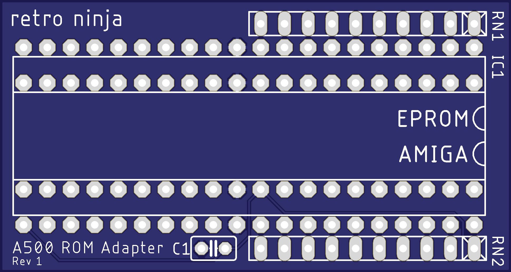

# Amiga 500 ROM Adapter
Adapter board that allows use of regular EPROMS on Amiga 500 Rev 5 boards
A500 boards with revision 6 and higher don't have these problems and don't need this adapter.

To be able to use regular 27C400 or 27C800 EPROMS on Amiga 500 Rev 5 boards, you will need to lift out pin 31 on the chip, connecting it to VCC and instead connect pin 31 in the socket to pin 1 on the chip.
If that wasn't enough there are compatibility problems between some EPROMS and some machines/CPUs which requires pull-up resistors on the address pins.
This simple adapter board solves both problems. It re-routes the EPROM pins and has place for two optional resistor nets.

*Diag ROM installed on a Rev 5 board*

## BOM
 |Component|Pcs |Name|Comment|
 |:--------|---:|:---|:------|
 | 100nF  ceramic capacitor| 1 | C1 | |
 | 4.7k resistor array | 1 | RN1, RN2 | 9 resistor arry (10SIP)| 
 | DIL-40 socket | 1 || EPROM socket for top side| 
 | 20-pin header | 2 || Round machined pin headers for bottom side (mates with motherboard) | 

Retro Ninja